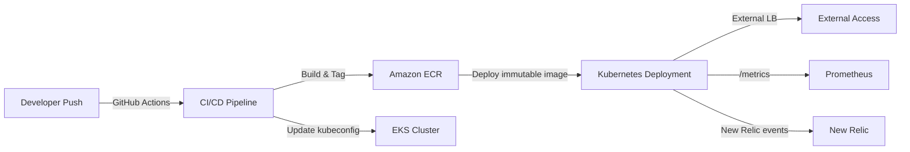

# FinOps Automation Platform

A cloud-native FinOps automation platform built to demonstrate practical DevOps and platform engineering skills with AWS, Kubernetes, CI/CD, observability, and cost analytics.

## 1. Project Overview

This repository implements a containerized FinOps analytics service that collects AWS Cost Explorer-style data, exposes metrics for Prometheus, and runs in Amazon EKS. The platform is designed to show an operational pipeline from developer push through GitHub Actions to immutable Docker images in ECR and managed workloads in EKS.

The focus is on operational readiness, traceable deployments, and a realistic platform engineering workflow rather than a simple application sandbox.

## 2. Business Problem / FinOps Motivation

The platform demonstrates how to reduce cloud waste by automating visibility into AWS spend and resource usage. Key motivations include:

- centralizing AWS cost data for automated analysis
- surfacing cost telemetry to monitoring systems
- detecting common FinOps issues such as idle EC2 capacity, unused EBS volumes, and sudden cost spikes
- showing a deployment workflow that supports repeatable infrastructure delivery

This is a FinOps-focused portfolio project that bridges cloud cost analytics, monitoring, and production deployment practices.

## 3. Architecture Overview

The system is architected as a Kubernetes-hosted platform with a single backend service that:

- ingests AWS billing/cost data from local JSON files in `data/`
- exposes `/metrics` for Prometheus-compatible scraping
- serves a simple frontend bundle from `backend/dist`
- provides operational endpoints such as `/health`
- integrates with New Relic via environment-backed secrets

The deployment pipeline uses GitHub Actions, builds a multi-stage Docker image, pushes it to Amazon ECR, and deploys it to Amazon EKS using `kubectl` and manifest templates.

## 4. Architecture Diagram Placeholder

Below is a placeholder for the architecture diagram.



## 5. Tech Stack

- Node.js + Express.js
- Docker multi-stage build
- Kubernetes manifests
- Amazon EKS
- Amazon ECR
- GitHub Actions
- AWS IAM OIDC Federation
- Prometheus metrics
- New Relic observability
- AWS Cost Explorer-style data ingestion
- Terraform for infrastructure scaffolding

## 6. Repository Structure

```
finops-automation-platform/
├── .github/workflows/deploy.yml
├── Dockerfile
├── README.md
├── aws-auth.yaml
├── backend/
│   ├── server.js
│   ├── package.json
│   ├── newrelic.cjs
│   ├── detectors/
│   │   ├── costSpikeDetector.js
│   │   ├── ebsWasteDetector.js
│   │   ├── idleEc2Detector.js
│   │   └── runDetections.js
│   └── dist/ (frontend bundle output)
├── data/
│   └── *.json
├── frontend/
│   ├── package.json
│   └── src/
├── infra/
│   ├── main.tf
│   ├── provider.tf
│   ├── variables.tf
│   └── outputs.tf
├── k8s/
│   ├── namespace.yaml
│   ├── configmap.yaml
│   ├── deployment.yaml
│   └── service.yaml
├── screenshots/
```

## 7. CI/CD Pipeline Flow

The GitHub Actions workflow in `.github/workflows/deploy.yml` follows this flow:

1. checkout repository
2. authenticate to AWS using OIDC via `aws-actions/configure-aws-credentials`
3. verify AWS identity
4. compute an immutable short SHA image tag
5. build Docker image locally
6. push image to Amazon ECR
7. install `kubectl` and patch manifests using `envsubst`
8. update kubeconfig for the target EKS cluster
9. validate Kubernetes access
10. apply namespace, configmap, and secrets
11. deploy the updated workload and verify rollout

The workflow demonstrates a production-style pattern where the deployment is tied to a specific immutable artifact and cluster state is validated before and after rollout.

## 8. Kubernetes Deployment Flow

Kubernetes deployment is driven by the manifests in `k8s/`:

- `namespace.yaml` creates the `finops` namespace
- `configmap.yaml` stores non-sensitive config values such as AWS region and app name
- `deployment.yaml` defines the backend workload and injects the ECR image tag at deploy time
- `service.yaml` exposes the app as a LoadBalancer service for external access

The deployment manifest uses `envsubst` during workflow execution to replace the placeholder image reference with the immutable ECR image tag.

## 9. Monitoring & Observability

The platform includes these observability components:

- `/metrics` endpoint for Prometheus-compatible scraping
- New Relic integration driven by `NEW_RELIC_LICENSE_KEY`
- custom metric events for AWS cost metrics
- `/health` endpoint for readiness and operational validation

Operational decisions:

- use a lightweight Prometheus metric export pattern rather than a full metrics agent
- keep observability configuration in Kubernetes configmap and secrets
- rely on the service entrypoint to provide active telemetry for cloud cost data

## 10. FinOps Detection Features

The repository implements several FinOps analysis engines in `backend/detectors/`:

- `costSpikeDetector.js` — detects sudden cost jumps
- `idleEc2Detector.js` — flags underutilized EC2 instances
- `ebsWasteDetector.js` — highlights unused EBS volume waste
- `runDetections.js` — orchestrates detector execution

These modules are designed to simulate real-world FinOps workflows and to demonstrate the ability to encode cloud cost heuristics inside a platform.

## 11. Metrics & Health Endpoints

Implemented runtime endpoints:

- `GET /metrics` — exposes Prometheus metrics, including AWS cost gauges
- `GET /health` — returns service health state and environment metadata
- `/api/*` — application API for demo frontend functionality

The `/metrics` endpoint is intentionally lightweight so it can be scraped by Prometheus or an observability stack without extra infrastructure.

## 12. Security Practices

The project adopts these security-oriented patterns:

- OIDC authentication from GitHub Actions to AWS IAM roles
- no long-lived AWS credentials in code or repo
- immutable image tagging using Git SHA
- runtime secrets injected through Kubernetes secrets
- Kubernetes config data separated into ConfigMap

## 13. Screenshots Section

Visual evidence of the platform is saved in `screenshots/`:

- `aws-cost-fetcher-pipeline-success.png`
- `finops-platform-observability-stack-live-on-eks.png`
- `finops-platform-service-dashboard.png`
- `full-kubernetes-workload-state.png`
- `hpa-working.png`
- `metrics-endpoint.png`
- `successful-cicd-deployment-pipeline.png`

## 14. How to Run Locally

1. Install dependencies for backend and frontend:

```bash
cd backend
npm install
cd ../frontend
npm install
```

2. Build the frontend bundle:

```bash
cd frontend
npm run build
```

3. Run the backend service:

```bash
cd ../backend
node server.js
```

4. Confirm local endpoints:

```bash
curl http://localhost:4000/health
curl http://localhost:4000/metrics
```

Local execution is primarily for development and validation. The production deployment path is through GitHub Actions and EKS.

## 15. How to Deploy to AWS EKS

1. Ensure the GitHub repository has `NEW_RELIC_LICENSE_KEY` configured in Secrets.
2. Ensure the EKS cluster is accessible and the OIDC IAM role is mapped in `aws-auth.yaml`.
3. Push to `main` or trigger the workflow manually.

The deployment workflow performs these actions:

- build and push the image to ECR
- update kubeconfig for the target EKS cluster
- apply Kubernetes namespace, configmap, and secrets
- deploy the backend workload
- verify rollout

If you need to apply infrastructure manually, use the `infra/` Terraform module to provision IAM and supporting resources.

## 16. GitHub Actions Workflow Explanation

The workflow uses OIDC and `aws-actions/configure-aws-credentials` so GitHub Actions can assume an AWS role without storing secrets.

That role is expected to have permissions to:

- push images to ECR
- update `kubeconfig` for the EKS cluster
- apply Kubernetes manifests in the target namespace

The deployment step is intentionally declarative: the manifest is generated from a template and kept immutable by image tag.

## 17. Lessons Learned

This repository was built to illustrate practical platform engineering decisions:

- multi-stage Docker builds reduce runtime image size and decouple frontend build artifacts from backend dependencies
- immutable tags are safer for Kubernetes deployments than `latest`
- separating config and secrets simplifies runtime changes without rebuilding images
- OIDC is the right choice for GitHub-to-AWS authentication in modern CI/CD
- Kubernetes service manifests should be simple and explicit for portfolio-grade examples

## 18. Future Improvements

This project is intentionally structured for further maturity, including:

- add real AWS Cost Explorer API ingestion instead of static JSON data
- implement Kubernetes readiness/liveness probes in `deployment.yaml`
- add horizontal pod autoscaling for workload resilience
- centralize observability with Prometheus and Grafana dashboards
- build a richer UI dashboard for FinOps alerts and cost recommendations
- extend Terraform support to manage the EKS cluster and `aws-auth` role binding end to end

## 19. Resume/Portfolio Value

This project is a strong DevOps portfolio piece because it shows:

- container lifecycle management with Docker and Kubernetes
- CI/CD engineering with GitHub Actions and immutable image tags
- AWS platform integration using EKS, ECR, and IAM OIDC
- observability design with Prometheus metrics and New Relic
- cloud cost automation and FinOps detection workflows
- infrastructure-as-code awareness through Terraform

